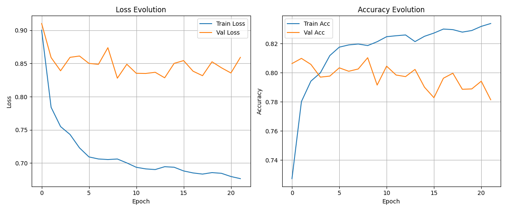

# SwiftCPEA: SwiftFormer for Few-Shot Image Classification with Class-Aware Token Patch Embedding Adaptation

Few-shot learning is difficult because the model must recognize new classes from only a few labeled examples. This is even harder for dataset where classes can look similar and noisy images.

SwiftCPEA is a few-shot classification architecture that combines a SwiftFormer visual backbone with a CPEA few-shot head. In this repository, I demonstrate the power of SwiftCPEA for Few-Shot Learning in underwater fish identification. Underwater fish identification is a challenging task due to the visual similarity between different species and the noisy nature of underwater images. Moreover, fish may appear with many different pose, angle, lighting, and background clutter.

## Architecture

The model combines two main parts:

### SwiftFormer Backbone

[SwiftFormer](https://openaccess.thecvf.com/content/ICCV2023/papers/Shaker_SwiftFormer_Efficient_Additive_Attention_for_Transformer-based_Real-time_Mobile_Vision_Applications_ICCV_2023_paper.pdf) is a lightweight hybrid CNN-transformer model. It combines the useful local pattern bias of convolutional networks with the broader context modeling of transformer-style blocks. It is a popular choice if we want a really lightweight model that is still able to achieve a very good performance.

But, one problem is that SwiftFormer meant for traditional image classification. So, we need to tweak it a little bit to work for few-shot learning. This is where the CPEA module comes in.

### CPEA Head

CPEA stands for Class-Aware Patch Embedding Adaptation, a module that is built for few-shot image classification task. It was introduced in the ICCV 2023 paper [Class-Aware Patch Embedding Adaptation for Few-Shot Image Classification](https://openaccess.thecvf.com/content/ICCV2023/papers/Hao_Class-Aware_Patch_Embedding_Adaptation_for_Few-Shot_Image_Classification_ICCV_2023_paper.pdf).

The main idea is, not every patch in image is important for classification. Especially the fish dataset case, it may introduce coral background, shadow or even other fish that may confuse the model. Thus, CPEA handle this by making patch-embeddings more class-aware. It adapts patch features using class-aware information, then compares support and query images using a dense patch-level similarity score.

More details about the module can be found in [CPEA's repository](https://github.com/FushengHao/CPEA).


### SwiftCPEA

The full model flow is:

```text
Input fish images
    -> SwiftFormer backbone
    -> patch-level image features
    -> CPEA few-shot head
    -> prediction over the support classes
```

SwiftFormer act as feature extractor, so we remove the last classifier head. Then, we replace the head with CPEA module. In this project, we use a pretrained `swiftformer_l3.dist_in1k` model from `timm`.

## Dataset

The dataset is built from iNaturalist fish observations, which is downloded using my other repo, [iNaturalist Fish Downloader](https://github.com/wikananda/inaturalist-fish-downloader)

## Experiment Result


The latest experiment reached about **89.42% ± 0.44% test accuracy** with 5-way 5-shot setting and 600 testing episodes.

## Running Training

Train with the Hydra config:

```bash
python train.py
```

The main config files are:

```text
configs/train.yaml
configs/data/dataset.yaml
configs/model/swiftformer_cpea.yaml
configs/training/default.yaml
```

Each training run saves its config, metrics, and checkpoint under `runs/`.

## Running Evaluation

Evaluate a saved run:

```bash
python test.py --run <run_folder_name>
```

Example:

```bash
python test.py --run swiftformer_l3.dist_in1k_5w5s_20260416_152917
```